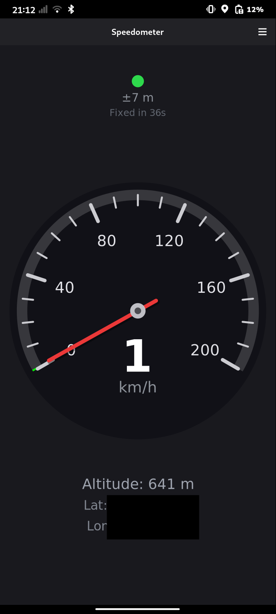
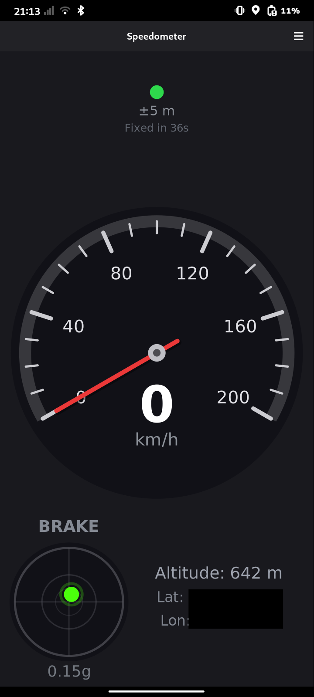
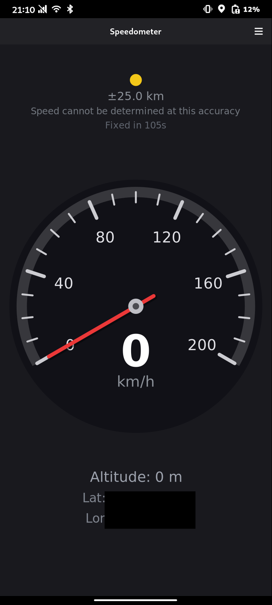
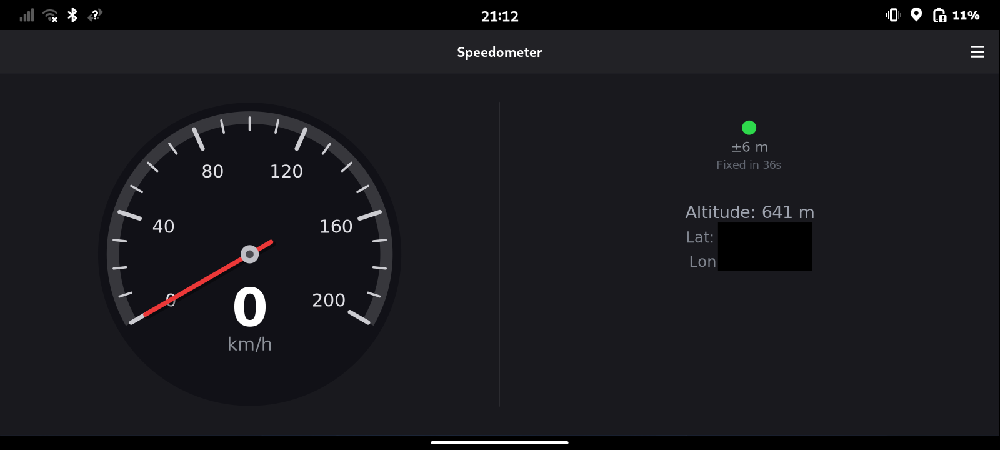

# Speedometer

Very simple Speedometer App built with GTK4/libadwaita and Rust. Aimed at mobile Linux devices such as the Furiphone or Pinephone.

## Disclaimer

For informational purposes only. Speed readings are GPS-based and approximate - not legally certified for any purpose. Do not use while driving. No warranty is given for accuracy or fitness for any particular purpose.

## Features

- Accuracy indicator that turns green once there is an actual GPS fix based on accuracy (because geoclue doesnt tell if it is just network or actual GPS location to my knowledge)
- Analogue dial and numbers to show speed
- Altitude
- Coordinates
- Switch between km/h and mph (top right menu button)
- Somewhat adaptive design for desktop usage if you happen to have a compatible GPS receiver

## Screenshots






## Credits

Inspired by [MOVEns](https://gitlab.com/_wilfridd/movens), an Ubuntu Touch App by _wilfridd.

## AI Disclosure

This application was built with the assistance of AI (GitHub Copilot CLI, Claude).

## Building

The easiest way to build the app is by using GNOME Builder IDE or flatpak-builder.

Example using flatpak-builder as a flatpak:
-  Install flatpak-builder
```
flatpak install org.flatpak.Builder
```

-  Compile the project into a local repo
```
flatpak run org.flatpak.Builder --repo=repo --force-clean --user build io.github.nico359.speedometer.json
```

-  Then create a bundle which you can install
```
flatpak build-bundle repo speedometer.flatpak io.github.nico359.speedometer
```


